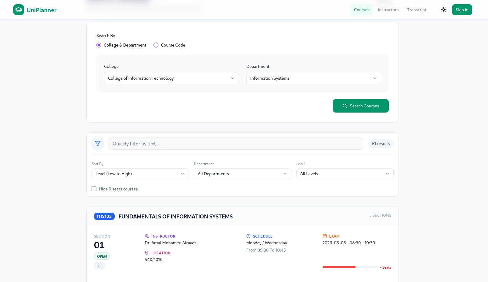
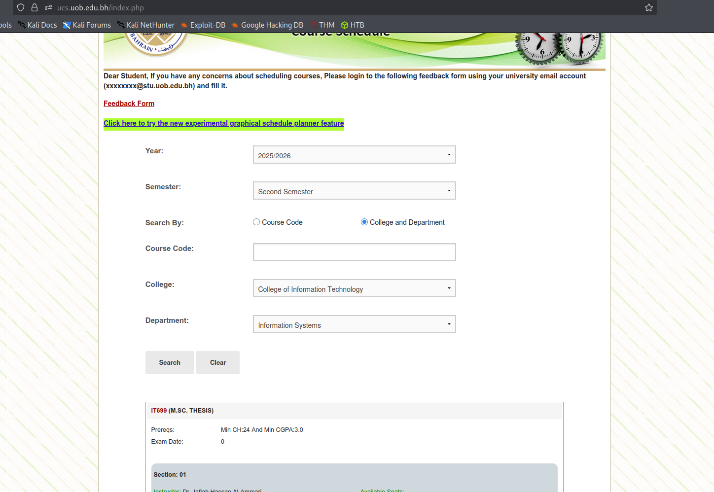

# UniPlanner

A modern replacement for the University of Bahrain (UOB) course catalog website - transforming the legacy UCS system into a beautiful, user-friendly experience.

> ⚠️ **Note:** This project is currently under active development. New features are being added regularly.

## 📸 Screenshots

### UniPlanner (New & Modern)


### Legacy UCS (Old System)


## Project Overview

UniPlanner is a full-stack web application designed to modernize and enhance the University of Bahrain's course management experience. It provides students with an intuitive interface to browse courses, find instructors, analyze transcripts, and plan their academic journey.

### ✨ Key Features

- **Course Catalog** - Browse and search through all available courses with advanced filtering
- **👨Instructor Directory** - Discover faculty members with detailed profiles, contact information, and course history
- **Transcript Analyzer** - Upload and analyze your UOB transcript with:
  - Automatic GPA calculation and honor classification
  - Grade distribution visualization with interactive charts
  - Semester-by-semester breakdown
  - Course search and filtering
  - Academic statistics dashboard
- **Modern UI** - Clean, responsive design with dark mode support
- **Fast Performance** - Built with Next.js for optimal speed and user experience

### Tech Stack

- **Frontend:** Next.js 15 (App Router), TypeScript, TailwindCSS, shadcn/ui
- **Backend:** Next.js API Routes
- **Database:** SQLite (Dev) / PostgreSQL (Prod) + Prisma ORM
- **PDF Processing:** pdftotext for transcript parsing
- **Deployment:** Vercel

## 🚀 Getting Started

### Prerequisites

- Node.js 20+ (via WSL on Windows recommended)
- npm or pnpm

### Installation & Running the Web Application

1.  **Clone the repository**
    ```bash
    git clone <repository-url>
    cd UniPlanner
    ```

2.  **Install dependencies**
    ```bash
    npm install
    ```

3.  **Setup the database**
    ```bash
    # Generate Prisma client
    npx prisma generate
    
    # Create/sync the database
    npx prisma db push
    ```

4.  **Run the development server**
    ```bash
    npm run dev
    ```
    
    The application will start on [http://localhost:3000](http://localhost:3000)

5.  **Open your browser** and navigate to [http://localhost:3000](http://localhost:3000)

For production, configure a PostgreSQL database in your deployment platform.

## 📊 Data Management

### Scraping Instructor Data

The project includes a Python scraper to gather instructor information from the UOB website:

```bash
# Install Python dependencies
pip install requests beautifulsoup4

# Run the scraper
python scraper/instructor_scraper.py
```

This generates `instructors.json` with faculty profiles.

### Importing Data to Database

After scraping, ingest the data into your database:

```bash
# Import instructors
npm run ingest
```

## 🎓 Features in Detail

### Transcript Analyzer
- **Automatic Parsing**: Upload your official UOB PDF transcript for instant analysis
- **GPA Classification**: 
  - First Class Honors (3.90 - 4.00)
  - Second Class Honors (3.70 - 3.89)
  - Distinction (3.50 - 3.69)
  - Very Good (3.00 - 3.49)
  - Good (2.00 - 2.99)
- **Smart Search**: Filter courses by code or name across all semesters
- **Visual Analytics**: Interactive grade distribution charts and academic statistics
- **Multi-Format Support**: Handles various transcript formats (orientation, summer, regular semesters)

### Instructor Directory
- **Comprehensive Profiles**: View contact details, office hours, and biography
- **Search & Filter**: Find instructors by name, department, or college
- **Course History**: See what courses each instructor teaches
- **Responsive Design**: Beautiful card layout with hover effects

## 🛠️ Development Status

This project is actively under development. Upcoming features include:
- Major plan builder
- Course scheduling assistant
- Prerequisite tracking
- Student reviews and ratings
- Mobile app version

## 🤝 Contributing

Contributions are welcome! Feel free to:
- Report bugs
- Suggest new features
- Submit pull requests
- Improve documentation

## 📝 License

This project is for educational purposes and is not officially affiliated with the University of Bahrain.

